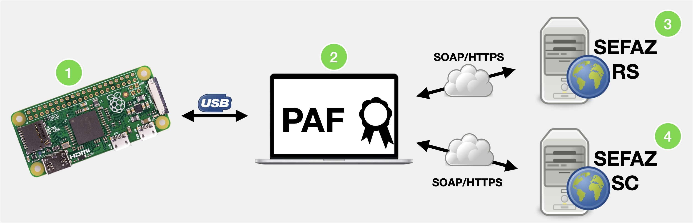

[](https://www.gnu.org/licenses/gpl-3.0)
> # Aviso de isenção de responsabilidade
>A presente prova de conceito (POC) é um artefato fruto do Contrato de Encomenda Tecnológica nº 001/2020, firmado entre a Secretaria de Estado da Fazenda de Santa Catarina e o Instituto Federal de Santa Catarina - IFSC.
>
>O objetivo desta prova de conceito é restrito aos objetivos contratados entre a SEF e o IFSC, compatível apenas com a versão 1.0.0 da especificação técnica de requisitos do DAF. Este artefato não tem como objetivo implementar completamente todos os processos de negócio previstos na especificação, visto que seu intuito foi demonstrar a viabilidade de implementação, tanto do DAF quanto da integração entre o PAF, DAF e a SEF-SC, utilizando tecnologias amplamente adotadas pelo mercado de desenvolvimento de software.
>
>Não cabe à SEF ou ao IFSC prestar suporte sobre os componentes, códigos ou excertos de código disponíveis nesta POC, sendo a presente versão considerada final, sem previsão de alterações, correção de bugs ou melhorias.
>
>A SEF e o IFSC eximem-se de qualquer responsabilidade, direta ou indireta, por perdas ou danos, comprovadamente ou alegadamente, causados pelos artefatos disponibilizados nesta POC. Caso deseje usar os componentes e softwares aqui disponibilizados, você estará fazendo isto exclusivamente por sua conta e risco.
# DAF-pi

**Sumário**
  - [Introdução](#introdução)
  - [Instalação e configuração do DAF-pi](#instalação-e-configuração-do-daf-pi)
    - [Requisitos de hardware](#requisitos-de-hardware)
    - [Requisitos de software](#requisitos-de-software)
    - [Instalação do DAF-pi a partir de imagem ISO pronta para uso](#instalação-do-daf-pi-a-partir-de-imagem-iso-pronta-para-uso)
    - [Instalação manual do DAF-pi a partir do código disponível nesse repositório](#instalação-manual-do-daf-pi-a-partir-do-código-disponível-nesse-repositório)
      - [Instalação do sistema operacional Raspberry Pi OS no cartão micro SD](#instalação-do-sistema-operacional-raspberry-pi-os-no-cartão-micro-sd)
      - [Baixar código fonte do DAF na Raspberry PI Zero W](#baixar-código-fonte-do-daf-na-raspberry-pi-zero-w)
      - [Configurar o sistema operacional da Raspberry Pi Zero W para que a mesma atue como um DAF](#configurar-o-sistema-operacional-da-raspberry-pi-zero-w-para-que-a-mesma-atue-como-um-daf)
  - [Facilidades específicas do DAF-pi para ajudar no desenvolvimento do PAF](#facilidades-específicas-do-daf-pi-para-ajudar-no-desenvolvimento-do-paf)
  - [Certificado da SEF e chave de ateste com o DAF-pi](#certificado-da-sef-e-chave-de-ateste-com-o-daf-pi)
  - [Limitações conhecidas](#limitações-conhecidas)
    - [Valor do *timeout* da camada ARQ do protocolo de comunicação](#valor-do-timeout-da-camada-arq-do-protocolo-de-comunicação)
  - [Dependências e bibliotecas de terceiros](#dependências-e-bibliotecas-de-terceiros)
## Introdução

Na [Especificação 1.0.0 do Dispositivo Autorizador Fiscal (DAF)](https://www.sef.sc.gov.br/arquivos_portal/servicos/136/DAF_Especificacao_de_Requisitos_1.0.0.pdf) são apresentados todos os casos de uso e protocolos que devem ser implementados pelo DAF para que o mesmo possa ser comandado pelo Programa Aplicativo Fiscal (PAF) para emissão de Nota Fiscal de Consumidor Eletrônica (NFC-e) em Santa Catarina.

Este repositório apresenta uma implementação de DAF em uma [Raspberry Pi Zero W](https://www.raspberrypi.org/products/raspberry-pi-zero-w/) e tem como público alvo desenvolvedores de PAF, uma vez que esses precisarão ter um DAF para validar suas implementações. O DAF-pi faz parte do *kit* de desenvolvimento oferecido aos desenvolvedores de PAF e fabricantes de DAF. Na figura abaixo são apresentadas todas as entidades que fazem parte do *kit* de desenvolvimento.



1. **DAF-pi** (este repositório)
   - Implementação em Python3 de todos os casos de uso da [Especificação 1.0.0 do Dispositivo Autorizador Fiscal (DAF)](https://www.sef.sc.gov.br/arquivos_portal/servicos/136/DAF_Especificacao_de_Requisitos_1.0.0.pdf) para ser executada exclusivamente em uma [Raspberry Pi Zero W](https://www.raspberrypi.org/products/raspberry-pi-zero-w/). O DAF-pi só pode ser usado como ferramenta de apoio para desenvolvimento do PAF, uma vez que a Raspberry Pi não atende os requisitos de segurança da especificação do DAF.
     - O **DAF-pi** foi desenvolvido considerando que seria mais fácil para o desenvolvedor de PAF adquirir no mercado uma Raspberry Pi Zero W. Contudo, também foi feita uma prova de conceito de DAF, denominada [DAF-poc](https://github.com/ifsc-lased/daf-poc), em um *hardware* com o microcontrolador MAX 32552 da Maxim. O código fonte desta prova de conceito pode ser obtido [neste repositório](https://github.com/ifsc-lased/daf-poc).
2. [**PAF** ](https://github.com/ifsc-lased/composicao-paf-sef)
   - O PAF do *kit* de desenvolvimento só implementa as rotinas cruciais para interação com o DAF, SEFAZ autorizadora e SEF. Trata-se assim de uma ferramenta de apoio que poderá ser usada por desenvolvedores de PAF e fabricantes de DAF.
3. [**SEFAZ Autorizadora**](https://github.com/ifsc-lased/composicao-paf-sef) 
   - A SEFAZ Autorizadora no *kit* de desenvolvimento tem como foco somente o caso de uso para autorização de uso de DF-e. A implementação consiste de uma simples rotina de persistência do DF-e autorizado para uso no banco de dados relacional usado pelo PAF. Sendo assim, não consiste de uma implementação real da SEFAZ autorizadora.
4. [**Secretaria de Estado da Fazenda de Santa Catarina (SEF)**](https://github.com/ifsc-lased/sef-ws) 
   - A SEF no *kit* de desenvolvimento provê implementação para os todos os casos de uso que envolvam diretamente o contribuinte e seu DAF, conforme apresentado na [Especificação 1.0.0 do Dispositivo Autorizador Fiscal (DAF)](https://www.sef.sc.gov.br/arquivos_portal/servicos/136/DAF_Especificacao_de_Requisitos_1.0.0.pdf). Por exemplo, registro de DAF, remoção de registro, autorização para remoção de autorização retida no DAF, entre outras.

> Disponibilizamos [aqui uma composição Docker](https://github.com/ifsc-lased/composicao-paf-sef) que permite facilmente montar um ambiente local de desenvolvimento composto pelas entidades PAF, SEFAZ autorizadora e SEF, apresentadas acima. 

## Instalação e configuração do DAF-pi

Nessa seção são apresentadas duas abordagens para ter um DAF-pi pronto para ser usado pelo PAF:
1. A abordagem mais simples é apresentada na seção [Instalação do DAF-pi a partir de imagem ISO pronta para uso](#instalação-do-daf-pi-a-partir-de-imagem-iso-pronta-para-uso), sendo essa a abordagem recomendada. 
2. Porém, se deseja instalar manualmente o código deste repositório em uma Raspberry Pi Zero W, então siga os passos apresentados na seção [Instalação manual do DAF-pi a partir do código disponível nesse repositório](#instalação-manual-do-daf-pi-a-partir-do-código-disponível-nesse-repositório).

Independente da abordagem que escolher, você terá que possuir os seguintes *hardwares* e *softwares*.

### Requisitos de hardware

* 01 [Raspberry Pi Zero W](https://www.raspberrypi.org/products/raspberry-pi-zero-w/)
* 01 Cabo micro-USB
* 01 Cartão micro-SD com pelo menos 8GB de armazenamento

### Requisitos de software

- [Raspberry Pi Imager](https://www.raspberrypi.org/downloads/) para permitir instalar a imagem ISO no cartão micro-SD da Raspberry Pi Zero W

### Instalação do DAF-pi a partir de imagem ISO pronta para uso

[Neste link](https://drive.google.com/file/d/1H0qM7BbiqLBvzG_fd3DcNIDgDVwuiFFW/view?usp=sharing) é disponibilizada uma imagem ISO do DAF-pi pronta para ser colocada no cartão micro-SD da Raspberry Pi Zero W. Essa é a maneira mais simples e rápida para ter um DAF-pi pronto para uso. Os passos para obtenção e instalação dessa imagem em um cartão micro-SD são:

1. Obter a imagem do DAF-pi disponibilizada [neste link](https://drive.google.com/file/d/1H0qM7BbiqLBvzG_fd3DcNIDgDVwuiFFW/view?usp=sharing)
2. Seguir os passos [desse vídeo](https://www.youtube.com/watch?v=ntaXWS8Lk34&ab_channel=RaspberryPi) para instalação do sistema operacional e configuração de rede da placa
3. Selecionar a imagem do DAF-pi recém obtida
   1. Habilitar acesso via SSH e definir uma senha de acesso para o usuário `pi`
   2. Configurar a rede da Raspberry Pi Zero W e aguardar a finalização do processo de instalação
4. Basta agora colocar o cartão micro SD na Raspberry Pi, conectar o cabo USB no computador onde está sendo executado o PAF e o conector micro USB na porta USB da Raspberry Pi W (é a porta micro USB mais próxima da porta HDMI).
5. :clap:  Pronto! Você tem um DAF-pi pronto para uso.

### Instalação manual do DAF-pi a partir do código disponível nesse repositório

Nessa seção são apresentados os passos para: 1) instalar o sistema operacional Raspberry Pi OS; 2) Acessar a Raspberry Pi Zero via SSH, baixar e instalar o código fonte disponível neste repositório; 3) configurar o sistema operacional da Raspberry Pi Zero W para que a mesma atue como um DAF.
#### Instalação do sistema operacional Raspberry Pi OS no cartão micro SD

   1. Execute o software [Raspberry Pi Imager](https://www.raspberrypi.org/downloads/)
   2. Siga os passos apresentados [neste video](https://www.youtube.com/watch?v=ntaXWS8Lk34&ab_channel=RaspberryPi) 
      1. Habilite o acesso via SSH e defina a senha de acesso para o usuário `pi`
      2. Configure a rede sem fio da Raspberry Pi Zero W
   3. Aguarde o término do processo de escrita no cartão micro SD
   4. Pronto! Coloque o cartão micro SD na Raspberry PI e conecte a alimentação de energia na mesma

#### Baixar código fonte do DAF na Raspberry PI Zero W

No passo anterior você ativou o servidor SSH na placa Raspberry e possibilitou que a mesma se conectasse na sua rede sem fio. Fazendo uso de um cliente SSH (e.g. ssh no Linux ou macOS, ou [PuTTY](https://www.putty.org) no Windows), conecte na placa Raspberry. Para isso você poderá conectar usando o endereço IP obtido pela placa ou pelo nome `raspberrypi.local`.  A senha do usuário `pi` foi definida por você durante a instalação do sistema operacional no cartão.

```bash
ssh pi@raspberrypi.local

cd ~
git clone https://github.com/ifsc-lased/daf-pi
cd daf-pi
python3 -m venv venv
source venv/bin/activate
pip3 install -r requirements.txt
```
#### Configurar o sistema operacional da Raspberry Pi Zero W para que a mesma atue como um DAF

> As linhas abaixo deverão ser executadas dentro da Raspberry, por meio de uma sessão remota (i.e. SSH)

Para que a Raspberry Pi Zero W se comporte como um dispositivo USB CDC-ACM, execute uma única vez o script [configura_gadget_usbcdc_daf.sh](res/configura_gadget_usbcdc_daf.sh).

```bash
sudo bash res/configura_gadget_usbcdc_daf.sh
```

Será feito uso do [supervisor](http://supervisord.org/) para garantir que o código do DAF seja executado automaticamente sempre que a a Raspberry Pi Zero W for energizada.

```bash
cd ~/daf-pi
sudo apt-get install supervisor
sudo cp res/supervisord.conf /etc/supervisor/
sudo supervisord -c /etc/supervisor/supervisord.conf
sudo shutdown -r now
```
:clap: Pronto! Você tem agora uma Raspberry Pi Zero W pronta para atuar como DAF.


## Facilidades específicas do DAF-pi para ajudar no desenvolvimento do PAF

Nessa seção são apresentadas comandos específicos que o DAF-pi implementa para gerar facilidades para o desenvolvimento do PAF. Todos os comandos aqui apresentados não estão de acordo com a [Especificação 1.0.0 do Dispositivo Autorizador Fiscal (DAF)](https://www.sef.sc.gov.br/arquivos_portal/servicos/136/DAF_Especificacao_de_Requisitos_1.0.0.pdf).

O DAF-pi pode a qualquer momento ser colocado no modo `padrão de fábrica`, estado no qual o dispositivo se comporta como um DAF recém adquirido. O [PAF](https://github.com/ifsc-lased/composicao-paf-sef) disponível no *kit* de desenvolvimento possui a funcionalidade para colocar o DAF-pi no modo `padrão de fábrica`. Ao ser invocada, o PAF envia a mensagem com o código `9999` ao DAF-pi.

> Este procedimento não reinicia a versão do `software básico` do DAF-pi, caso o mesmo tenha sido atualizado.

De acordo com a especificação do DAF, o identificador único do DAF (`idDAF`) é imutável. Porém, o desenvolver de PAF poderia ter a necessidade de testar seu PAF com mais de um DAF. Para que o desenvolver não precise ter vários DAF-pi, o DAF-pi implementa um comando que permite alterar seu `idDAF`. 

O [PAF](https://github.com/ifsc-lased/composicao-paf-sef) disponível no *kit* de desenvolvimento possui a funcionalidade para solicitar a alteração do `idDAF` do DAF-pi. Ao ser invocada, o PAF envia a mensagem com o código `9997` ao DAF-pi. Esse procedimento gera um novo `idDAF` e coloca o DAF-pi no `padrão de fábrica`, ou seja, o mesmo se comporta como um DAF recém adquirido. 

> Este procedimento não reinicia a versão do `software básico` do DAF-pi, caso o mesmo tenha sido atualizado.

De acordo com a especificação do DAF, o DAF pode ir para o estado inutilizado se acontecer alguma ação não permitida, como uma tentativa de revelação do material criptográfico mantido em sua memória segura. 

O [PAF](https://github.com/ifsc-lased/composicao-paf-sef) disponível no *kit* de desenvolvimento possui a funcionalidade para colocar o DAF-pi no estado inutilizado. o ser invocada, o PAF envia a mensagem com o código `9998` ao DAF. 

> O DAF-pi, quando no estado de inutilizado, não transmitirá suas informações a cada 30 segundos, como descrito na especificação de requisitos do DAF. No caso, transmitirá essas informações sempre que receber uma mensagem do PAF que seja diferente da mensagem que o levaria para o modo `padrão de fábrica`.

## Certificado da SEF e chave de ateste com o DAF-pi

De acordo com a [Especificação Técnica de Requisitos do DAF](https://www.sef.sc.gov.br/arquivos_portal/servicos/136/DAF_Especificacao_de_Requisitos_1.0.0.pdf), o DAF deverá conter o certificado digital da SEF. Por outro lado, a SEF já deverá ter a chave pública, par da chave de ateste do DAF.

A [SEF](https://github.com/ifsc-lased/sef-ws) deste kit de desenvolvimento contém a chave pública, par da [chave de ateste do DAF-pi](daf_virtual_rasp/resources/ateste-priv-ec.pem). E o DAF-pi contém o [certificado da SEF](daf_virtual_rasp/resources/sef-cert-ec.pem). Esse certificado digital da SEF é auto assinado e tem validade até `2031-05-27 14:35:18`.

> A especificação do DAF permite o uso de chaves criptográficas RSA ou EC. A chave de ateste do DAF-pi é uma chave EC P-384, enquanto que a chave pública contida no certificado da SEF também é uma chave EC P-384.

Desenvolvedores de DAF, que forem usar o kit de desenvolvimento disponibilizado, precisarão incluir a chave de ateste na SEF do kit e dentro de seu DAF terão que incluir o certificado da SEF.

## Limitações conhecidas

### Valor do *timeout* da camada ARQ do protocolo de comunicação

Em função da placa Raspberry Pi Zero W não possuir um acelerador criptográfico, algumas operações podem demorar mais tempo que o valor de *timeout* da camada ARQ do protocolo de comunicação definido na [Especificação Técnica de Requisitos do DAF](https://www.sef.sc.gov.br/arquivos_portal/servicos/136/DAF_Especificacao_de_Requisitos_1.0.0.pdf). 

Desta forma, na implementação do DAF-pi o valor do *timeout* da camada ARQ é de **2 segundos**. O PAF que for interagir com este DAF-pi deve definir o mesmo valor para o *timeout* da camada ARQ de sua implementação do protocolo de comunicação do DAF. 

> O [PAF](https://github.com/ifsc-lased/composicao-paf-sef) disponível no *kit* de desenvolvimento tem o *timeout* definido em 2 segundos.

## Dependências e bibliotecas de terceiros

O código do DAF-pi foi desenvolvido na linguagem Python3 e faz uso das seguintes bibliotecas de terceiros:


| Biblioteca |Função| Licença |
|------------|------|---------|
|[JWCrypto](https://github.com/latchset/jwcrypto)|Decifragem de token JWE|[GNU Lesser GPLv3](https://github.com/latchset/jwcrypto/blob/master/LICENSE)|
|[cryptography](https://github.com/pyca/cryptography)|Operações criptográficas|[Apache 2.0](https://github.com/pyca/cryptography/blob/main/LICENSE.APACHE) e [BSD](https://github.com/pyca/cryptography/blob/main/LICENSE.BSD)|
|[PyCryptodome](https://github.com/Legrandin/pycryptodome) | Operações criptográficas|[BSD e OCB](https://github.com/Legrandin/pycryptodome/blob/master/LICENSE.rst)|
|[PyJWT](https://github.com/jpadilla/pyjwt) |Geração e validação de tokens JWT| [MIT License](https://github.com/jpadilla/pyjwt/blob/master/LICENSE)|
|[Authlib](https://github.com/lepture/authlib)| Dependência da biblioteca PyJWT|[BSD](https://github.com/lepture/authlib/blob/master/LICENSE)|
|[pySerial](https://github.com/pyserial/pyserial) | Comunicação serial|[BSD](https://github.com/pyserial/pyserial/blob/master/LICENSE.txt)|
|[TinyDB](https://github.com/msiemens/tinydb/blob/master/LICENSE) |Representação dos tipos de memória do DAF| [MIT License](https://github.com/msiemens/tinydb/blob/master/LICENSE)|
|[pytype](https://github.com/google/pytype) |Documentação do código |[Apache 2.0 e MIT](https://github.com/google/pytype/blob/master/LICENSE)|
|[wheel](https://github.com/pypa/wheel) |Dependência de algumas bibliotecas |[MIT License](https://github.com/pypa/wheel/blob/master/LICENSE.txt)|